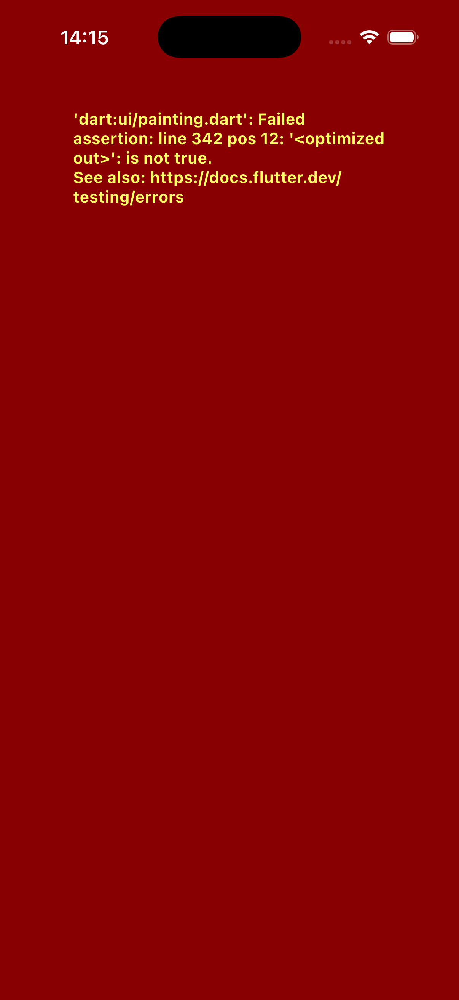

# 听着 - Tsing Music 🎵

> **高端发烧友的音乐播放器 | A Premium Music Player for Audiophiles.**

---

## ✨ 核心亮点 | Highlights

### 🎨 极致视觉 (High-Fidelity UI)
- **3D Coverflow**: 深度自研物理引擎，还原经典的流动封面体验。
- **Glassmorphism**: 全局毛玻璃质感，适配 iOS 原生审美。
- **Dynamic Background**: 智能提取专辑色，打造沉浸式听歌氛围。

### 🔌 强大连接 (Connectivity)
- **Navidrome Native**: 完美适配 Navidrome 自建音乐服务器。
- **Subsonic Protocol**: 支持所有兼容 Subsonic 协议的服务端。
- **Global Ready**: 内置中英双语，面向全球用户设计。

### 🚀 极致性能 (Performance)
- **Fluid Motion**: 60FPS 丝滑流畅。
- **Smart Cache**: 智能本地缓存管理，节省流量。

---

## 📸 预览 | Preview

  

---

## 📥 下载 | Download

请前往 **Releases** 页面下载最新的安装包。

- **iOS**: 下载 `.ipa` 文件。
- **Android**: *Coming Soon...*

---

## ☕ 赞赏 | Support

如果你喜欢这款播放器，欢迎请作者喝杯咖啡。你的支持是我持续更新的最大动力！

  

---

## 📄 关于与反馈 | About & Feedback

- 本仓库仅作为 **Tsing Music** 的官方发布主页。
- **源代码目前不公开 (Private Source Code)**。
- 如果你有任何建议或发现了 Bug，请直接提交 [Issue](https://github.com/tsingter/tsing-music/issues)。

---
*Made with ❤️ by Ding*
